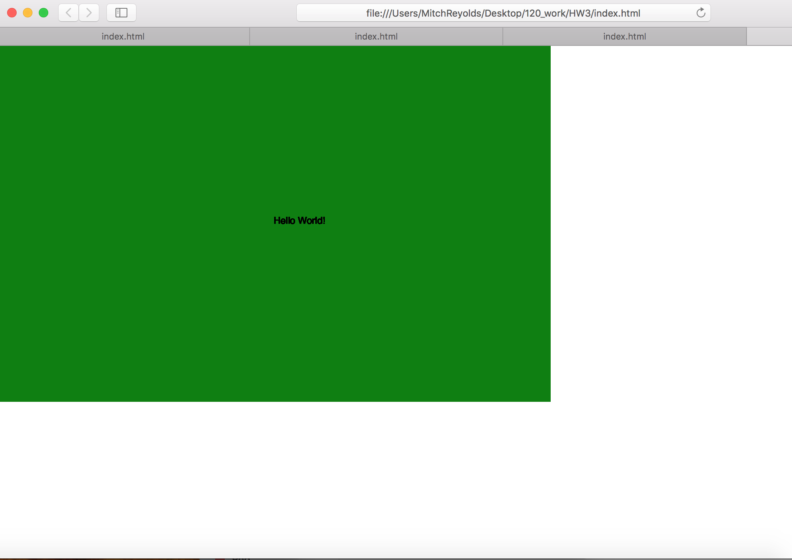

Mitch Reynolds, 50

["Hello World!"](https://mitchrey26.github.io/120-work/HW3/)

# HW3 Response

I found this week very rewarding and a very good week for me. I found the videos very helpful as I would just follow along on the videos than after the video was over I would spend a little bit of tie reviewing the content of the video whether I was making an ellipse or changing the background of my page.

The steps I took to complete the assignment were really just working on atom and writing down all of the codes that were needed to create something that I could see on line. The first time I got the hello world just on the screen I saw that to be super cool and than for the homework assignment where I put the words over the background I thought that was really cool I am excited to get into more creative ways to code.

I didn't have any major issues this week sometimes I forgot to save my work on atom and I was getting frustated that it wasn't showing up online but than once I learned to save my work that fixed that problem. I also had an issue with my repository where I  it said it couldn't find my 120-work repo but I just re upload the file and it fixed that problem

## HW3 Sketch

This is how my final sketch turned out

